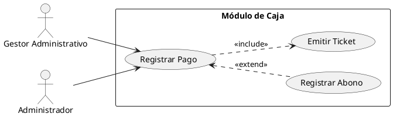

# Skill: Diagramas de Casos de Uso (PlantUML)

Esta skill define las reglas y estándares para estructurar diagramas de casos de uso en código PlantUML a partir de requisitos funcionales, omitiendo requerimientos del sistema y agrupando funcionalidades por módulo.

## Reglas de Construcción

1. **Actores:**
   - Representan a las personas o sistemas externos que interactúan con el software.
   - Definir con la palabra clave `actor` (ej. `actor Administrador`, `actor Gestor`, `actor Docente`).
2. **Casos de Uso:**
   - Representan los objetivos que el actor puede lograr en el sistema.
   - Definir usando paréntesis o la palabra clave `usecase` (ej. `usecase "Registrar Pago" as UC_RegistrarPago`).
   - Deben estar redactados en infinitivo (ej. "Crear cuenta", "Inscribir Alumno").
3. **Agrupación por Módulos:**
   - Utilizar el elemento `rectangle` de PlantUML para delimitar el límite del sistema o de un módulo específico (ej. `rectangle "Módulo 1: Gestión de Usuarios" { ... }`).
4. **Relaciones:**
   - Usar flechas simples `--` o `-->` para conectar actores con casos de uso.
   - Usar relaciones `<<include>>` cuando un caso de uso requiere obligatoriamente de otro.
   - Usar relaciones `<<extend>>` cuando un caso de uso extiende opcionalmente a otro bajo ciertas condiciones.
5. **Formato de Archivo:**
   - El código generado debe ser guardado directamente en un archivo con extensión `.puml`.
   - El archivo debe iniciar obligatoriamente con `@startuml <nombre_del_diagrama>` (ej. `@startuml M01_AccesoUsuarios`) y terminar con `@enduml` para evitar advertencias de diagrama sin nombre.

## Ejemplo de Referencia

