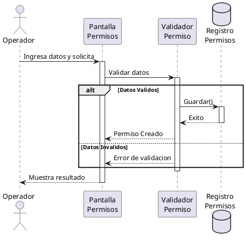

# Generador de Diagramas de Secuencia

Esta skill te instruye a generar diagramas de secuencia (PlantUML) mapeando los pasos de un Caso de Uso hacia interacciones técnicas, apoyándote en el Diagrama de Robustez previo si existe.

## Reglas de Construcción
1. **Actores y Participantes:** El Actor inicia la interacción. Los participantes deben coincidir con los Boundaries, Controls y Entities definidos en el Diagrama de Robustez.
2. **Mensajes:** Utiliza flechas sólidas `->` para mensajes sincrónicos (solicitudes) y flechas punteadas `-->` para respuestas o retornos.
3. **Flujos Alternos:** Utiliza bloques `alt`, `opt` o `loop` para representar los flujos alternativos, excepciones y repeticiones.
4. **Formato de Archivo:** El código generado debe ser guardado **directamente** en un archivo con extensión `.puml`. NO envuelvas el código en bloques Markdown ni le agregues títulos con hashtags. El archivo debe comenzar obligatoriamente con `@startuml <nombre_del_diagrama>` (ej. `@startuml rf_60_registrar_un_pago`) y terminar con `@enduml` para evitar advertencias de diagrama sin nombre.

## Reglas del Proyecto (Colegio San Diego)
- Toma en cuenta que las validaciones y reglas de negocio deben estar representadas interactuando con los Controls, y los guardados interactuando con la Base de Datos local.

## Ejemplo de Referencia

