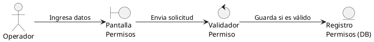

# Generador de Diagramas de Robustez

Esta skill te instruye a generar diagramas de robustez (PlantUML) respetando estrictamente el patrón Boundary-Control-Entity (BCE).

## Reglas de Construcción
1. **Boundaries (Límites):** Representan las interfaces (pantallas, ventanas, APIs externas). Los actores SOLO pueden comunicarse con Boundaries.
2. **Controls (Controles):** Representan la lógica de negocio, validaciones y cálculos. Un Boundary no puede hablar con una Entity directamente, debe pasar por un Control.
3. **Entities (Entidades):** Representan el almacenamiento de datos o los registros en la base de datos (PostgreSQL local). Solo los Controls pueden comunicarse con ellas.
4. **Formato de Archivo:** El código generado debe ser guardado **directamente** en un archivo con extensión `.puml`. NO envuelvas el código en bloques Markdown ni le agregues títulos con hashtags. El archivo debe comenzar con `@startuml` y terminar con `@enduml`.

## Reglas del Proyecto (Colegio San Diego)
- **Modelo Híbrido LAN:** Existen boundaries del tipo "Tauri Desktop UI" (para el Administrador) y "Navegador Web UI" (para docentes y administrativos).
- **Ejemplo Referencial:** El siguiente ejemplo es puramente estilístico (basado en un dominio externo) y NUNCA debe copiarse tal cual en este proyecto.

## Ejemplo de Referencia (CU033 Crear Permiso Temporal)

