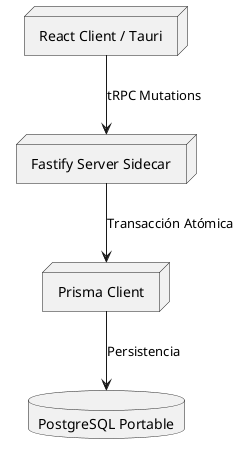

# Auditoría de Cumplimiento Técnico — [Nombre del Módulo o Sistema]

Este documento presenta el informe de auditoría técnica general del estado actual del sistema, evaluando la arquitectura, la base de datos y la implementación del backend y frontend para asegurar su estabilidad e integridad.

---

## I. Título y Metadatos

| Campo | Detalle |
| :--- | :--- |
| **Proyecto** | Sistema de Gestión Académico (SGA) |
| **Fecha de Emisión** | 2026-07-06 |
| **Auditor** | Agente de Arquitectura |
| **Estado General** | ⚠️ En Riesgo |
| **Módulos Evaluados** | Pagos, Inscripciones, Base de Datos |

---

## II. Propósito y Resumen Ejecutivo

La presente auditoría tiene como propósito diagnosticar la viabilidad técnica y detectar brechas de calidad previo a la liberación en producción de los nuevos módulos transaccionales. Se busca mitigar fallos en el manejo de estados financieros e inconsistencias en inscripciones.

> [!WARNING]
> **Riesgo Crítico de Negocio**: Se detectó que la lógica para guardar el saldo a favor de los tutores en el monedero digital no cuenta con validación atómica en caso de cancelaciones parciales de cobros, lo cual puede derivar en pérdidas monetarias.

---

## III. Análisis de Arquitectura

El flujo de información y persistencia sigue la siguiente arquitectura de integración entre el frontend y el backend sidecar:

---

## IV. Matriz de Deuda Técnica por Módulos

### 1. Capa Database

| Módulo / Componente | Deuda Técnica / Hallazgo | Impacto | Esfuerzo | Remediación Sugerida |
| :--- | :--- | :---: | :---: | :--- |
| **Relación Alumno-Tutor** | El campo `saldoAFavor` en `Tutor` es redundante e incumple la 3FN respecto al histórico de `MovimientoSaldo`. | Medio | Medio | Normalizar o asegurar integridad relacional en la capa de servicios. |
| **Adeudos (CalendarioPago)** | Faltan índices explícitos en columnas de búsqueda recurrente: `fechaVencimiento` y `estadoCobro`. | Medio | Bajo | Añadir directiva `@@index([fechaVencimiento, estadoCobro])` en `schema.prisma`. |
| **Transacciones de Pago** | El campo `montoTotal` en la BD está definido como float, propiciando errores de redondeo financiero. | Crítico | Bajo | Migrar el tipo de columna a `Decimal(10, 2)` en PostgreSQL. |

### 2. Capa Backend

| Módulo / Componente | Deuda Técnica / Hallazgo | Impacto | Esfuerzo | Remediación Sugerida |
| :--- | :--- | :---: | :---: | :--- |
| **Inscripciones** | El controlador realiza lógica y cálculos de becas directamente en la mutación tRPC, rompiendo el principio de responsabilidad única (SOLID). | Alto | Medio | Extraer la lógica de negocio a un método en `InscripcionesService`. |
| **Persistencia** | Consistencia adecuada en la separación de responsabilidades físicas en capas DAO/Repository y Service. | Bajo | Bajo | Ninguna (adherido a Clean Code). |

### 3. Capa Frontend

| Módulo / Componente | Deuda Técnica / Hallazgo | Impacto | Esfuerzo | Remediación Sugerida |
| :--- | :--- | :---: | :---: | :--- |
| **Caja / Cobros** | El componente de cobro no inhabilita los inputs durante la carga de la petición, permitiendo cobros duplicados por doble click. | Alto | Bajo | Inhabilitar inputs y el botón de acción de React durante el estado `pending` de la mutación tRPC. |
| **Configuración** | La lógica de cálculo de recargos está acoplada al componente visual. | Medio | Medio | Extraer la lógica a un hook personalizado (`useRecargos.ts`). |

### 4. Capa Infraestructura

| Módulo / Componente | Deuda Técnica / Hallazgo | Impacto | Esfuerzo | Remediación Sugerida |
| :--- | :--- | :---: | :---: | :--- |
| **Seguridad de Sidecar** | El token JWT expira de forma correcta, pero no se restringen peticiones externas al sidecar de Fastify. | Alto | Medio | Implementar filtrado de IP en Fastify para asegurar que las llamadas procedan del cliente local de Tauri (127.0.0.1). |

---

## V. Reporte de Rendimiento

| Procedimiento / Endpoint | Tiempo Promedio (ms) | Umbral Límite (ms) | Estado (Óptimo/Alerta/Crítico) | Cuello de Botella Detectado | Acción Recomendada |
| :--- | :---: | :---: | :---: | :--- | :--- |
| `getAlumnos` | 45 | 100 | Óptimo | Ninguno | Mantener monitorizado. |
| `registrarPago` | 320 | 150 | Crítico | Múltiples operaciones síncronas de base de datos ejecutadas en un bucle `for`. | Refactorizar usando `Promise.all` o una transacción de base de datos por lotes. |
| `consultarAforos` | 180 | 100 | Alerta | Consultas relacionales anidadas ineficientes ejecutadas de forma redundante. | Optimizar la consulta usando selectores explícitos `include` e indexación de FKs. |

---

## VI. Matriz de Prioridades

| Hallazgo / Gap | Impacto | Esfuerzo | Prioridad |
| :--- | :---: | :---: | :---: |
| Migrar float a Decimal en Base de Datos | Crítico | Bajo | **Alta** |
| Prevenir doble click en botón de cobros | Alto | Bajo | **Alta** |
| Extraer lógica de cálculo de recargos a hook | Medio | Medio | **Media** |
| Indexar columnas de vencimiento de adeudos | Medio | Bajo | **Media** |

---

## VII. Plan de Acción

### Fase 1: Correcciones Críticas (Base de Datos e Integridad)
1. Crear migración Prisma para cambiar el tipo de datos de float a Decimal.
2. Refactorizar el repositorio de pagos para añadir redondeos explícitos a dos decimales.

### Fase 2: Optimización de Código
1. Extraer la lógica de aforos a una consulta agregada de Prisma.
2. Bloquear el botón de pago en la UI mientras la transacción tRPC se encuentra en estado `pending`.

---

## VIII. Checklist de Producción y Estado de Avance

* [x] Diseñar los esquemas e índices necesarios en el entorno local.
* [/] Ejecutar migración de tipos exactos en la base de datos de staging.
* [ ] Implementar la remediación del botón de doble click en el frontend.
* [ ] Desplegar binarios actualizados del sidecar en la app de Tauri.
