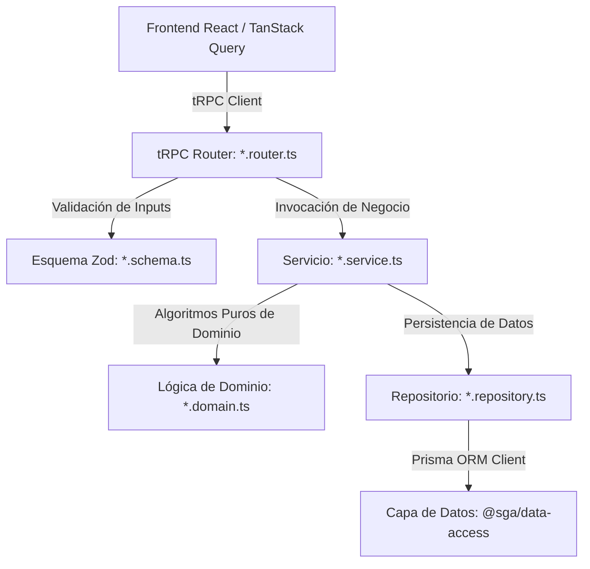

# Especificación Arquitectónica y Funcional del Backend (`@sga/back-end`)

Este documento define la arquitectura interna, las capas operativas, las convenciones técnicas y la especificación detallada de los 15 módulos que componen el paquete `@sga/back-end` en el Sistema de Gestión Académica (SGA) del Colegio San Diego.

---

## 1. Patrón Arquitectónico por Capas

El backend del SGA se ejecuta dentro de un servidor de Node.js con **Fastify**, exponiendo procedimientos tipados de **tRPC** hacia el frontend de React. Para garantizar orden, mantenibilidad, testabilidad e independencia entre la lógica de negocio y la base de datos, el backend sigue estrictamente un patrón por capas:

### Responsabilidades por Archivo
1. **`*.schema.ts` (Esquemas de Validación Zod):**
   * Define los esquemas de entrada (DTOs de entrada) y salida (si aplica) de los procedimientos tRPC.
   * Ningún procedimiento de mutación o consulta tipada debe procesarse sin haber sido validado previamente por su esquema Zod correspondiente.
2. **`*.router.ts` (Enrutador tRPC):**
   * Es el punto de entrada de la API. Define procedimientos `query` (lectura) y `mutation` (escritura).
   * Aplica middlewares de autenticación y autorización por rol (`protectedProcedure`, `adminProcedure`, etc.).
   * No contiene lógica de negocio pesada ni consultas directas a Prisma; delega la ejecución en los métodos de `*.service.ts`.
3. **`*.service.ts` (Capa de Servicio y Lógica de Negocio):**
   * Coordina flujos de negocio complejos, transacciones y reglas escolares o financieras.
   * Transforma datos brutos y coordina con lógica puramente algorítmica (`*.domain.ts`).
   * Aplica políticas de seguridad, bloqueo por morosidad y validaciones institucionales.
4. **`*.domain.ts` (Lógica de Dominio Pura - Opcional/Crítica):**
   * Archivos sin dependencias de infraestructura ni ORMs que contienen algoritmos matemáticos o financieros puros y comprobables (ej. `recalculoFinanciero.domain.ts`).
   * Facilita la creación de pruebas unitarias exhaustivas sin necesidad de un motor PostgreSQL.
5. **`*.repository.ts` (Capa de Acceso a Base de Datos):**
   * Única capa del backend autorizada para invocar al cliente Prisma exportado por `@sga/data-access`.
   * Encapsula consultas `findMany`, `create`, `update`, y transacciones (`$transaction`).
   * Convierte tipos de Prisma que no son serializables directamente a JSON (como `Decimal` o fechas estrictas) a tipos seguros de TypeScript antes de devolverlos al servicio (**Safe Type Boundaries**).

---

## 2. Especificación Detallada de los 15 Módulos del Backend

### 1. Módulo de Alumnos (`alumnos`)
*   **Propósito:** Administración integral de la información personal, académica y de salud del estudiantado.
*   **Archivos Base:** `alumnos.schema.ts`, `alumnos.router.ts`, `alumnos.service.ts`, `alumnos.repository.ts`, `ciclo-vida-alumno.test.ts`.
*   **Procedimientos tRPC Principales:**
    *   `alumnos.listar`: Obtiene el listado de alumnos con filtrado por grupo, grado, estado y adeudos.
    *   `alumnos.obtenerPorId`: Devuelve el expediente académico y financiero detallado.
    *   `alumnos.crear` / `alumnos.actualizar`: Alta y modificación con validación estricta de campos obligatorios.
    *   `alumnos.cambiarEstado`: Transiciona al alumno entre estados institucionales.
    *   `alumnos.eliminar`: Ejecuta baja suave (*Soft Delete* mediante `eliminadoEn`).
*   **Algoritmos y Reglas de Negocio:**
    *   **Máquina de Estados:** `Activo` ↔ `Baja Temporal`, `Activo` → `Baja Definitiva`, `Activo` → `Egresado`, `Activo` → `Transición Pendiente`.
    *   **Reingreso sin Duplicidad:** Si se da de alta a un alumno en estado inactivo o con la misma CURP, el sistema reactiva el expediente existente sin generar nuevos IDs ni duplicar registros de historial.

### 2. Módulo de Auditoría (`auditoria`)
*   **Propósito:** Bitácora inmutable de eventos sensibles para el control institucional y auditoría financiera/académica.
*   **Archivos Base:** `auditoria.schema.ts`, `auditoria.router.ts`, `auditoria.service.ts`, `auditoria.repository.ts`.
*   **Procedimientos tRPC Principales:**
    *   `auditoria.listar`: Devuelve el historial de eventos con paginación y filtro por rango de fechas, usuario o entidad afectada.
    *   `auditoria.registrar`: Procedimiento interno/middleware para insertar registros de evento.
*   **Algoritmos y Reglas de Negocio:**
    *   **Inmutabilidad Absoluta:** Prohibido el uso de `UPDATE` o `DELETE` sobre la tabla de auditoría.
    *   **Acceso Exclusivo Root:** Solo el usuario con rol de `Root` (Administradora dueña) tiene permisos para consultar este historial.
    *   **Captura de Snapshots:** Guarda automáticamente el valor anterior (`oldData`) y el nuevo valor (`newData`) en formato JSON al alterar calificaciones, cancelar cobros o aprobar becas.

### 3. Módulo de Autenticación y Seguridad (`auth`)
*   **Propósito:** Gestión de la identidad de usuarios locales en la red LAN y validación de sesiones por token.
*   **Archivos Base:** `auth.router.ts`, `auth.service.ts`, `auth.schema.ts`.
*   **Procedimientos tRPC Principales:**
    *   `auth.login`: Autenticación con credenciales (usuario/contraseña) devolviendo token de sesión.
    *   `auth.logout`: Revocación del token activo.
    *   `auth.me`: Obtención de información y permisos del usuario autenticado en el contexto actual.
*   **Algoritmos y Reglas de Negocio:**
    *   **Sesiones LAN:** Emisión de JWT almacenados y transmitidos con expiración por inactividad para garantizar la seguridad en computadoras escolares compartidas.
    *   **Jerarquía de Roles:** Enforce estricto entre `Administradora` (completo), `Gestor` (cobranza, catálogos, sin autorización de becas) y `Docente` (captura exclusiva de calificaciones de sus grupos asignados).

### 4. Módulo de Becas y Descuentos (`becas`)
*   **Propósito:** Configuración, solicitud y aplicación de apoyos financieros institucionales (hermanos, promociones, convenios).
*   **Archivos Base:** `becas.schema.ts`, `becas.router.ts`, `becas.service.ts`, `becas.repository.ts`.
*   **Procedimientos tRPC Principales:**
    *   `becas.listar`: Consulta de becas activas y en solicitud.
    *   `becas.solicitar`: Creación de propuesta de beca para un alumno/tutor.
    *   `becas.aprobar` / `becas.rechazar`: Autorización formal de la beca en el sistema.
*   **Algoritmos y Reglas de Negocio:**
    *   **Exclusión Mutua de Becas:** La "Beca de Hermanos" (descuento del 30% fijo) y las "Promociones Estacionales de Inscripción" no pueden apilarse; el servicio calcula y rechaza asignaciones múltiples en un mismo concepto.
    *   **Flujo de Dos Pasos (Autorización):** Si un rol `Gestor` asigna una beca, su estado se inicializa como `Solicitud Pendiente` y no surte efecto en el monto a cobrar hasta que el rol `Administradora` invoca el procedimiento `aprobar`.

### 5. Módulo de Calificaciones y Kardex (`calificaciones`)
*   **Propósito:** Captura periódica del aprovechamiento académico por materia/grupo y consolidación del historial inmutable (Kardex).
*   **Archivos Base:** `calificaciones.schema.ts`, `calificaciones.router.ts`, `calificaciones.service.ts`, `calificaciones.repository.ts`.
*   **Procedimientos tRPC Principales:**
    *   `calificaciones.capturarPorGrupo`: Guardado en lotes de calificaciones trimestrales/bimestrales por materia.
    *   `calificaciones.obtenerBoleta`: Consulta estructurada para la impresión o renderizado del formato oficial PDF.
    *   `calificaciones.obtenerKardex`: Extracción del historial perpetuo a lo largo de todos los ciclos cursados.
    *   `calificaciones.cerrarPeriodo`: Congelamiento oficial del bimestre/trimestre.
*   **Algoritmos y Reglas de Negocio:**
    *   **Evaluación Híbrida:** Soporte para escala cualitativa en Preescolar y escala numérica (0-10 con decimales) en Primaria y Secundaria.
    *   **Bloqueo por Adeudo:** Si un alumno incurre en morosidad mayor al periodo legal/establecido, el middleware del servicio intercepta e imposibilita al docente la captura de examen/calificación y bloquea la emisión de su boleta oficial.
    *   **Inmutabilidad de Periodo Cerrado:** Una vez invocado `cerrarPeriodo`, la calificación pasa a modo Solo Lectura. Cualquier rectificación requiere autorización y genera rastro de auditoría.

### 6. Módulo de Configuración y Parámetros (`configuracion`)
*   **Propósito:** Almacenamiento de variables institucionales del Colegio San Diego, logotipos, datos fiscales y configuración del servidor SMTP.
*   **Archivos Base:** `configuracion.schema.ts`, `configuracion.router.ts`, `configuracion.service.ts`, `configuracion.repository.ts`.
*   **Procedimientos tRPC Principales:**
    *   `configuracion.obtener`: Consulta la configuración local activa.
    *   `configuracion.actualizar`: Modifica parámetros de alertas o recargos.
    *   `configuracion.probarSmtp`: Envía un correo de verificación local para comprobar la conectividad LAN/Internet con el proveedor de correo.
*   **Algoritmos y Reglas de Negocio:**
    *   **Caché en Memoria:** Los parámetros de uso intensivo (ej. monto de recargo y días de gracia) son mantenidos en caché en memoria por Fastify para evitar lecturas repetitivas a la base de datos en bucles financieros.

### 7. Módulo de Dashboard y Métricas (`dashboard`)
*   **Propósito:** Consolidación rápida de indicadores clave (KPIs) para la pantalla principal de administración.
*   **Archivos Base:** `dashboard.schema.ts`, `dashboard.router.ts`, `dashboard.service.ts`.
*   **Procedimientos tRPC Principales:**
    *   `dashboard.obtenerMetricasGenerales`: Alumnos activos, morosos, ingresos diarios y mensuales.
    *   `dashboard.obtenerAlertas`: Listado de becas pendientes de aprobar, convenios próximos a vencer o alumnos en transición pendiente.
*   **Algoritmos y Reglas de Negocio:**
    *   **Consultas Agregadas de Rendimiento:** Emplea agregaciones nativas de Prisma (`groupBy`, `count`, `sum`) sobre tablas de cobranza para retornar en menos de 150ms al cargar la aplicación en la PC principal.

### 8. Módulo de Grupos y Ciclos Escolares (`grupos`)
*   **Propósito:** Organización de los grupos estudiantiles, grados, materias y asignación de docentes en ciclos anuales o semestrales.
*   **Archivos Base:** `grupos.schema.ts`, `grupos.router.ts`, `grupos.service.ts`, `grupos.repository.ts`.
*   **Procedimientos tRPC Principales:**
    *   `grupos.listar`: Consulta de grupos por ciclo escolar.
    *   `grupos.crear` / `grupos.actualizar`: Mantenimiento de la estructura escolar.
    *   `grupos.asignarDocente`: Vincula un profesor al grupo/materia.
*   **Algoritmos y Reglas de Negocio:**
    *   **Soporte de Ciclos Paralelos:** Permite mantener grupos anuales (Primaria) conviviendo en paralelo con ciclos semestrales o talleres adicionales, validando que el alumno no tenga traslapes incompatibles de horario.

### 9. Módulo de Importaciones (`importaciones`)
*   **Propósito:** Carga masiva e inicial del padrón del Colegio San Diego desde hojas de cálculo históricas (Excel/CSV).
*   **Archivos Base:** `importaciones.schema.ts`, `importaciones.router.ts`, `importaciones.service.ts`.
*   **Procedimientos tRPC Principales:**
    *   `importaciones.validarArchivo`: Recibe datos tabulares en bruto y valida sintaxis, duplicados y referencias rotas antes de insertar.
    *   `importaciones.ejecutarCarga`: Realiza la inserción masiva en transacciones atómicas.
*   **Algoritmos y Reglas de Negocio:**
    *   **Transacciones Atómicas con Rollback:** Si de una lista de 200 familias falla la fila 199 por un dato erróneo (ej. fecha mal formateada), la transacción se revierte (`Prisma.$transaction`), impidiendo padrones inconsistentes o huérfanos.

### 10. Módulo de Inscripciones (`inscripciones`)
*   **Propósito:** Asistente guiado (Wizard) para la matriculación de alumnos de nuevo ingreso o reinscripción regular.
*   **Archivos Base:** `inscripciones.schema.ts`, `inscripciones.router.ts`, `inscripciones.service.ts`, `inscripciones.repository.ts`.
*   **Procedimientos tRPC Principales:**
    *   `inscripciones.ejecutarWizard`: Crea atómicamente al Tutor, Alumno, Contactos de Emergencia y genera el calendario de pagos.
    *   `inscripciones.verificarPlazos`: Identifica adeudos de inscripción vencidos o próximos a expirar.
*   **Algoritmos y Reglas de Negocio:**
    *   **Prevención de Alumnos Huérfanos:** Es un flujo transaccional ininterrumpible de 4 pasos (Tutor → Alumno → Contactos → Adeudos de Inscripción/Colegiatura según plan 10 o 12 meses).
    *   **Plazo Duro de Inscripción:** El concepto de Inscripción tiene un plazo de cobro duro de máximo **60 días naturales**. Al pasar el día 55, el módulo programa notificaciones de aviso.

### 11. Módulo de Caja, Pagos y Cobranza (`pagos`) — *Núcleo Financiero*
*   **Propósito:** Caja unificada de cobro del colegio, administración del calendario de adeudos, recargos automáticos, convenios por morosidad y cortes de caja diarios.
*   **Archivos Base:** `pagos.schema.ts`, `pagos.router.ts`, `pagos.service.ts`, `pagos.repository.ts`, `recalculoFinanciero.domain.ts`.
*   **Procedimientos tRPC Principales:**
    *   `pagos.cobrarCajaUnificada`: Procesa el pago de uno o múltiples conceptos de manera simultánea en una sola transacción, emitiendo comprobante.
    *   `pagos.ejecutarRecargosAutomaticos`: Trabajo en segundo plano o desencadenado para evaluar morosidad y crear adeudos de recargo.
    *   `pagos.crearConvenio`: Formaliza el acuerdo de pago por rezago.
    *   `pagos.realizarCorteCaja`: Audita e inmutabiliza los cobros recibidos en el día.
    *   `pagos.recalcularAdeudos`: Invoca el motor algorítmico para ajustar saldos cuando se altera una tarifa o beca.
*   **Algoritmos y Reglas de Negocio Críticas:**
    *   **Recargo Automático Inapelable ($400 MXN):** El servicio calcula exactamente **5 días hábiles de gracia** posteriores al vencimiento de cada colegiatura. Transcurrido ese plazo sin pago liquidado, se anexa automáticamente el adeudo de recargo de $400.
    *   **Congelamiento por Convenio de Pago:** Al registrar un convenio para un tutor rezagado, una bandera de exclusión congela la generación de recargos automáticos mientras el convenio esté en estado vigente.
    *   **Algoritmo de Conciliación de Adeudos (`RecalculoFinancieroDomain`):**
        *   Implementado en clase de dominio pura (`recalculoFinanciero.domain.ts`).
        *   Toma como entrada `AdeudoActual[]` y `AdeudoIdeal[]`.
        *   Aplica un pool de pagos formales (`appPool`) y excesos sin referencia (`excesoSinPagoId`) sobre las tarifas actualizadas, determinando saldos pendientes con precisión a dos decimales (`Math.round(val * 100) / 100`).
        *   Asigna dinámicamente el estado financiero de cada concepto:
            *   `EstadoCobro.PAGADO` (saldoPendiente <= 0, asignando `liquidadoAt`).
            *   `EstadoCobro.ABONO` (pago parcial aplicado con saldo pendiente > 0).
            *   `EstadoCobro.PENDIENTE` (monto aplicado igual a 0).
        *   Consolida sobrantes y devuelve el monto total disponible para saldos a favor futuras (`saldoAFavorTotal`).
    *   **Corte de Caja Diario:** Sella criptográfica o relacionalmente el lote de pagos recibidos en el turno del gestor, impidiendo su edición o cancelación retroactiva.

### 12. Módulo de Reportes (`reportes`)
*   **Propósito:** Extracción, agregación y exportación tabular de información institucional (financiera y escolar).
*   **Archivos Base:** `reportes.schema.ts`, `reportes.router.ts`, `reportes.service.ts`.
*   **Procedimientos tRPC Principales:**
    *   `reportes.exportarCobranza`: Genera archivo tabular (CSV/Excel) por periodos, cajero o conceptos.
    *   `reportes.exportarKardex`: Genera el archivo para la sábana de calificaciones.
    *   `reportes.exportarMorosidad`: Entrega el listado de familias y alumnos en situación de impago.
*   **Algoritmos y Reglas de Negocio:**
    *   **Transformación de Frontera Segura:** Asegura que todos los campos monetarios exportados no contengan errores de notación científica y respeten los separadores decimales locales (`.` o `,` según configuración).

### 13. Módulo de Almacenamiento Local y Respaldo (`storage`)
*   **Propósito:** Gestión del sistema de archivos del sistema de escritorio, guardado de boletas PDF generadas y orquestación de respaldos `.zip`.
*   **Archivos Base:** `storage.schema.ts`, `storage.router.ts`, `storage.service.ts`.
*   **Procedimientos tRPC Principales:**
    *   `storage.crearRespaldo`: Invoca y coordina la ejecución local del utilitario de base de datos para compresión en archivo `.zip`.
    *   `storage.guardarBoleta`: Almacena el PDF emitido en la ruta local configurada.
    *   `storage.listarRespaldos`: Devuelve el historial de copias de seguridad existentes.
*   **Algoritmos y Reglas de Negocio:**
    *   **Respaldo Disaster Recovery (LAN):** Genera volcados en una ruta compartida o supervisada por clientes de almacenamiento en la nube (Google Drive/OneDrive), manteniendo una retención rotativa local (ej. últimos 15 respaldos para no saturar disco).

### 14. Módulo de Tutores (`tutores`)
*   **Propósito:** Mantenimiento del expediente financiero, familiar y legal de los padres o tutores del colegio.
*   **Archivos Base:** `tutores.schema.ts`, `tutores.router.ts`, `tutores.service.ts`, `tutores.repository.ts`.
*   **Procedimientos tRPC Principales:**
    *   `tutores.listar`: Búsqueda de familias por nombre, teléfono o RFC.
    *   `tutores.obtenerEstadoCuenta`: Retorna la consolidación unificada de todos sus hijos y adeudos.
    *   `tutores.crear` / `tutores.actualizar`: ABM del responsable económico.
*   **Algoritmos y Reglas de Negocio:**
    *   **Consolidación Familiar 1:N:** El estado de cuenta agrupa automáticamente todos los adeudos de los alumnos (hermanos) inscritos a nombre de un mismo tutor, permitiendo pagar la colegiatura de varios niños en un solo recibo.

### 15. Módulo de Usuarios del Sistema (`usuarios`)
*   **Propósito:** Administración de cuentas de acceso al software de escritorio (Administradora, Gestores y Docentes).
*   **Archivos Base:** `usuarios.schema.ts`, `usuarios.router.ts`, `usuarios.service.ts`, `usuarios.repository.ts`.
*   **Procedimientos tRPC Principales:**
    *   `usuarios.listar`: Catálogo de usuarios operativos.
    *   `usuarios.crear` / `usuarios.actualizar`: Registro y asignación de rol.
    *   `usuarios.cambiarContrasena`: Modificación segura del secreto de acceso.
*   **Algoritmos y Reglas de Negocio:**
    *   **Protección Inviolable de Cuenta Root:** El usuario principal (Administradora del colegio) no puede ser eliminado, desactivado ni degradado en sus permisos bajo ninguna circunstancia.
