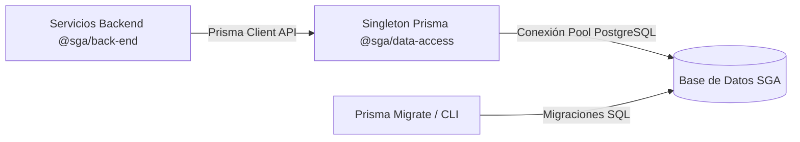
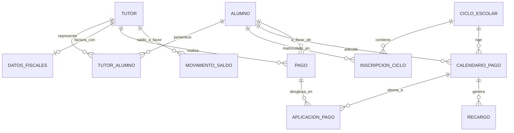

# Especificación Arquitectónica del Modelo de Base de Datos (`@sga/data-access`)

Este documento define la estructura técnica, los modelos relacionales, las convenciones de nomenclatura, las políticas de integridad y el desglose en dominios del esquema oficial de base de datos del Sistema de Gestión Académica (SGA) del Colegio San Diego, ubicado en `packages/data-access/prisma/schema.prisma`.

---

## 1. Motor, Arquitectura de Persistencia y Convenciones

El SGA opera sobre **PostgreSQL**, ejecutado en las computadoras del colegio ya sea mediante un sidecar autogestionado en el ejecutable de **Tauri** (`PostgreSQL Portable` en entornos de escritorio LAN) o en un servidor local.

### Convenciones de Nomenclatura (`schema.prisma`)
1. **Idioma de Dominio (Español):** Todas las entidades (`model`), columnas y enums utilizan terminología académica y financiera mexicana en español (`Tutor`, `Alumno`, `CalendarioPago`, `Recargo`), alineándose con el lenguaje ubicuo del personal administrativo del Colegio San Diego.
2. **CamelCase en Código vs Snake_Case en Base de Datos:**
   * En TypeScript y en los nombres de modelos de Prisma, se utiliza `CamelCase` para entidades (ej. `CalendarioPago`) y `camelCase` para campos (ej. `fechaVencimiento`).
   * Mediante la directiva `@map("nombre_columna")` y `@@map("nombre_tabla")`, cada elemento se traduce a `snake_case` estricto a nivel de SQL de PostgreSQL (ej. table `calendario_pago`, column `fecha_vencimiento`).
3. **Singleton de Acceso:** El paquete `@sga/data-access` es la única fuente de verdad (`Single Source of Truth`). Ningún otro paquete o sidecar puede instanciar drivers de base de datos ni escribir migraciones fuera de esta carpeta.

---

## 2. Diagrama Entidad-Relación Global (Mermaid ER)

A continuación se representa la relación entre las entidades centrales que articulan el padrón estudiantil, las inscripciones y el núcleo de cobranza:

---

## 3. Especificación Técnico-Relacional por Dominios (26 Modelos y 8 Enums)

El esquema se divide de manera cohesiva en **6 dominios lógicos**:

### Dominio I: Seguridad y Control de Acceso (RBAC & Sesiones)
Gestión de identidad, control de acceso basado en roles y protección de sesiones en computadoras LAN escolares.
*   **`Rol`:** Catálogo de roles operativos (`codigo`: `ROOT`, `ADMIN`, `GESTOR`, `DOCENTE`).
*   **`Usuario`:** Cuentas de personal de escritorio (`nombreUsuario`, `passwordHash`). Almacena políticas de seguridad como `intentosFallidos`, `bloqueadoHasta` y flag `debeCambiarPwd`.
*   **`UsuarioRol`:** Tabla intermedia para asignación N:M de roles a usuarios, con trazabilidad de quién otorgó el rol (`asignadoPor`, `asignadoEn`).
*   **`UsuarioPermisoModulo`:** Configuración de permisos de excepción por módulo funcional, regido por el enum `NivelPermiso` (`LECTURA`, `LECTURA_Y_ESCRITURA`, `DENEGADO`).
*   **`IntentoLogin`:** Bitácora forense de inicios de sesión (`exitoso`, `direccionIp`, `userAgent`).
*   **`TokenRevocado`:** Lista negra de JWTs revocados (`jti`, `expiraEn`) para posibilitar el cierre de sesión inmedible y seguro en red LAN compartida.

### Dominio II: Configuración Institucional y Bitácora de Auditoría
Parámetros del sistema y registro inmutable de transacciones sensibles.
*   **`ConfiguracionGlobal`:** Registro singleton (`configuracionId`) que dicta reglas generales: día del mes para vencimientos (`diaVencimientoMensual`), monto de recargo por defecto ($400 MXN en `montoRecargoDefecto`), días de gracia (`diasGraciaRecargo` = 5) y umbrales para notificaciones automáticas (`umbralesSmtpDias`).
*   **`ConfiguracionRecargo`:** Catálogo para especializar reglas de recargo según el concepto cobrado (`conceptoPago`, `monto`, `diasGracia`).
*   **`LogAuditoria`:** Registro perpetuo e inmutable (`logId` como `BigInt`) de toda mutación crítica (`UPDATE`/`DELETE`). Almacena instantáneas en formato JSON (`valoresAntes`, `valoresDespues`) junto con la IP y la `tablaAfectada`.

### Dominio III: Estructura Escolar y Académica
Modelado de la jerarquía escolar desde el nivel educativo hasta el pase de lista diario.
*   **`NivelEducativo`:** Niveles que imparte el colegio (`Preescolar`, `Primaria`, `Secundaria`), incluyendo RVOE oficial (`rvoe`) y número de orden jerárquico.
*   **`Grado`:** Grado numerado (ej. 1°, 2°, 3°) vinculado a un nivel educativo.
*   **`CicloEscolar`:** Periodo lectivo (`fechaInicio`, `fechaFin`), con bandera de operatividad (`activo`, `abierto`) y soporte de `periodicidad` (anual o semestral paralela).
*   **`Grupo`:** Grupo estudiantil asignado a un grado y ciclo (ej. 1° "A"), con control de `cupoMaximo` y estado `cerrado`.
*   **`Materia`:** Asignaturas o talleres extracurriculares con `clave` única y clasificación (`tipo`).
*   **`GrupoMateria`:** Relación intermedia (tabla de carga académica) que vincula un grupo con sus materias e individualiza al profesor responsable (`docenteId`).
*   **`Calificacion`:** Registro evaluativo por materia y periodo (`periodoId`). Soporta escala dual: cualitativa en Preescolar (`valorCualitativo`) y cuantitativa en Primaria/Secundaria (`valorNumerico`), regida por el enum `TipoEvaluacion` (`PARCIAL`, `BIMESTRE`, `BLOQUE`, `TRIMESTRE`).
*   **`Asistencia`:** Control diario de asistencia (`asistenciaId`) por alumno y materia, registrando `estado` y `justificacion`.

### Dominio IV: Padrón Escolar, Familiar y Fiscal (Relación 1:N)
Expedientes administrativos e integración fiscal de familias del colegio.
*   **`Tutor`:** Persona económicamente responsable de uno o varios alumnos (`tutorId`). Almacena sus datos de contacto y la billetera de crédito familiar (`saldoAFavor`, tipo de dato `Decimal(12, 2)`).
*   **`DatosFiscales`:** Relación 1:1 con `Tutor` para facturación CFDI (RFC de 13 caracteres, `razonSocial`, `regimenFiscal`, `usoCfdi` y `codigoPostal`).
*   **`Alumno`:** Expediente general del estudiante (`matricula`, `curp`, `nombreCompleto`, `fechaNacimiento`). Controla su estatus escolar con el enum `EstadoAlumno` (`ACTIVO`, `BAJA_TEMPORAL`, `BAJA_DEFINITIVA`, `EGRESADO`, `TRANSICION_PENDIENTE`, `RETENCION_FINANCIERA`, `RETENCION_ACADEMICA`, `PREINSCRIPCION`).
*   **`TutorAlumno`:** Tabla de vinculación N:M (usualmente 1:N familiar) que une tutores y alumnos. Define si el tutor `esPrincipal` (recibe cobranza oficial) y el `parentesco`.

### Dominio V: Núcleo Financiero, Cobranza y Saldo a Favor
Motor de finanzas, planes de pago de 10/12 meses, caja unificada y recargos fijos automáticos.
*   **`Tarifa`:** Catálogo normativo de precios de conceptos por nivel y ciclo escolar (`monto` en `Decimal(12, 2)`).
*   **`PlanPago`:** Plantilla que determina la periodicidad y estructura mensual del pago, como los esquemas de 10 meses vs 12 meses, contemplando variaciones como `montoDiciembre`.
*   **`InscripcionCiclo`:** Matrícula oficial del alumno en un ciclo escolar (`alumnoId`, `cicloId`), asignándole un `grupoId` y un `planPagoId`, trackeando si es ingreso tardío y cuántos `mesesAdeudo` acumula.
*   **`CalendarioPago`:** Tabla transaccional central. Representa cada cuenta por cobrar (ej. Colegiatura Septiembre, Inscripción). Almacena `montoOriginal`, `montoPagado`, `montoRecargo`, `saldoPendiente` y su estado financiero con el enum `EstadoCobro` (`PENDIENTE`, `ABONO`, `PAGADO`, `VENCIDO`, `CANCELADO`).
*   **`Pago`:** Comprobante del ingreso recibido en caja por un cajero (`registradoPor`). Almacena el `montoTotal`, fecha de pago y el enum `MetodoPago` (`DEPOSITO`, `TRANSFERENCIA`, `TARJETA_DEBITO`, `TARJETA_CREDITO`).
*   **`AplicacionPago`:** Tabla de conciliación y desglose. Cada registro relaciona cuánto dinero de un `Pago` (`montoAplicado`) se destinó a abonar o liquidar un ítem específico de `CalendarioPago`.
*   **`Recargo`:** Adeudo accesorio vinculado a un `CalendarioPago` moroso. Almacena historial de modificación de recargos y si fue condonado por convenio o dirección.
*   **`MovimientoSaldo`:** Libro mayor patrimonial del tutor (`Tutor.saldoAFavor`). Registra créditos (ej. excedentes pagados sin referencia) y débitos cuando el saldo a favor es consumido en cobros posteriores.

### Dominio VI: Becas, Promociones y Gestión Digital
Administración de subsidios, expedientes digitalizados y cola de notificaciones.
*   **`Beca`:** Catálogo de subsidios e incentivos del colegio, clasificados bajo el enum `CriterioBeca` (`ACADEMICA`, `SOCIOECONOMICA`, `DEPORTIVA`, `CULTURAL`, `POR_HERMANOS`, `PROMOCION_TEMPRANA`, `EXTERNA`).
*   **`SolicitudBeca`:** Petición de apoyo para un alumno (`motivo`). Su ciclo de aprobación opera en el enum `EstadoBeca` (`ACTIVA`, `SUSPENDIDA`, `CANCELADA`, `VENCIDA`), auditando quién solicitó (`solicitadaPor`) y quién resolvió (`resueltaPor`).
*   **`AsignacionBeca`:** Beca formalmente autorizada y aplicada al alumno en el ciclo actual.
*   **`VentanaInscripcionTemprana`:** Fechas límite estacionales en las que se aplican descuentos o becas de promoción de manera automática en la reinscripción.
*   **`Documento`:** Repositorio de archivos adjuntos (boletas en PDF, comprobantes de pago, CURP en imagen), registrando `rutaAlmacen`, `tamanoBytes` y sello hash de integridad `hashSha256`.
*   **`Notificacion`:** Cola transaccional de avisos por correo o SMS (`destinatarioEmail`, `asunto`, `cuerpo`, `programadaPara`, `enviadaEn`) orientada a cobranza preventiva y clasificada en `TipoNotificacion` (`ADEUDO`, `BECA`, `PAGO_VENCIDO`, `CIERRE_CICLO`, `DOCUMENTACION`).

---

## 4. Reglas Críticas de Integridad Relacional y Tipos

### 1. Borrado Lógico Suave (*Soft Delete*)
*   Para evitar la pérdida accidental de expedientes o inconsistencias en los libros contables, prácticamente todas las entidades principales (`Alumno`, `Tutor`, `CalendarioPago`, `Usuario`, etc.) incluyen la columna `eliminadoEn: DateTime? @map("eliminado_en")`.
*   Una entidad con `eliminadoEn != null` se considera eliminada y es filtrada automáticamente por los servicios y middlewares de consulta de Prisma, protegiendo el historial referencial.

### 2. Precisión Monetaria Estricta (`Decimal(12, 2)`)
*   Todas las cifras monetarias del sistema (`Tarifa.monto`, `CalendarioPago.montoOriginal`, `Pago.montoTotal`, `Tutor.saldoAFavor`) se declaran como `@db.Decimal(12, 2)`.
*   Se prohíbe el uso de tipos `Float` o números de coma flotante estándar de JavaScript para cálculos en la base de datos, eliminando por completo errores de redondeo financiero (ej. `0.1 + 0.2 != 0.30`).
*   La capa del backend debe transformar estos objetos `Prisma.Decimal` en fronteras tipadas seguras para serialización tRPC.

### 3. Integridad Referencial y Transaccionalidad
*   **Unicidad Escolar:** Índices `@unique` garantizan que no existan matrículas duplicadas (`Alumno.matricula`), CURPs repetidas (`Alumno.curp`) ni claves de materia solapadas (`Materia.clave`).
*   **Transacciones Atómicas de Caja:** Todo cobro en caja unificada invoca una transacción en base de datos (`Prisma.$transaction`) que engloba: (a) creación del `Pago`, (b) creación de registros en `AplicacionPago`, (c) reducción de `saldoPendiente` y actualización del `EstadoCobro` en los registros de `CalendarioPago`, y (d) inserción en `MovimientoSaldo` si existió remanente a favor del tutor.
