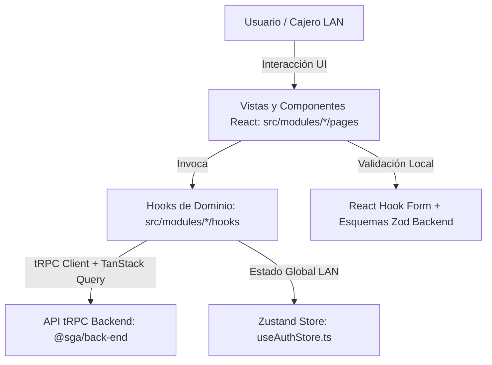
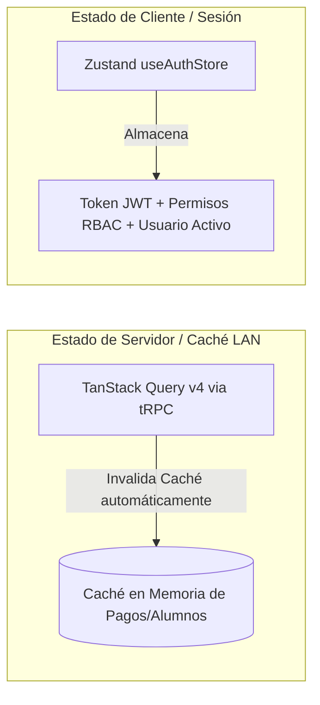

# Especificación Arquitectónica del Frontend (`@sga/front-end`)

Este documento define la arquitectura visual, el stack tecnológico, el diseño modular, las estrategias de gestión de estado (servidor vs cliente) y las convenciones de interfaz del Sistema de Gestión Académica (SGA) del Colegio San Diego, cuyo código fuente reside en el paquete `packages/front-end`.

---

## 1. Stack Tecnológico Moderno y Seguridad de Tipado (tRPC)

El frontend del SGA es una aplicación de página única (**SPA**) construida bajo las herramientas más eficientes del ecosistema moderno de TypeScript, optimizada para ejecución local de escritorio (**Tauri**) o navegador en red LAN:

*   **Núcleo Visual:** **React 18.3.1** con **TypeScript 6.0** y motor de construcción ultrarrápido **Vite 8.1.1**.
*   **Diseño y Estilos:** **Tailwind CSS v4** (`@tailwindcss/vite`) complementado con iconografía institucional coherente mediante **Lucide React**.
*   **Seguridad de Tipado End-to-End (`tRPC`):** El cliente visual importa la firma del enrutador raíz (`AppRouter`) directamente del paquete `@sga/back-end`. Cualquier cambio estructural o de reglas de validación (Zod) en el backend es detectado en tiempo de compilación por el frontend, garantizando una comunicación API libre de errores por desalineación de contratos.



---

## 2. Arquitectura Modular por Dominio (`src/modules/*`)

En lugar de separar código en carpetas horizontales genéricas y gigantes (`components/`, `hooks/`, `pages/` mezclando toda la escuela), el frontend se estructura en **módulos verticales y autónomos por dominio de negocio**, reflejando la arquitectura del backend.

```
src/
├── modules/
│   ├── alumnos/        # Expediente, ciclo de vida escolar, listados
│   ├── auth/           # Login, recuperación de acceso, vistas de autenticación
│   ├── configuracion/  # Parámetros del colegio y pruebas de red/SMTP
│   ├── dashboard/      # Pantalla principal con KPIs y métricas agregadas
│   ├── grupos/         # Asignaciones por grado, ciclo y profesor
│   ├── pagos/          # Caja unificada, recibos, convenios y morosidad
│   ├── tutores/        # Estado de cuenta familiar unificado y fiscales
│   └── usuarios/       # Administración de cuentas del personal operativo
├── router/             # Definición de rutas y Protección RBAC (ProtectedRoute)
├── store/              # Estado cliente persistente (Zustand)
└── lib/ / utils/       # Clientes HTTP/tRPC y ayudantes de formateo
```

### Estructura Interna Estándar de cada Módulo
Cada directorio dentro de `src/modules/<modulo>` sigue el patrón:
1.  **`components/`:** Componentes visuales y modales especializados y encapsulados para ese dominio (ej. `CajaUnificadaForm.tsx`, `TablaKardex.tsx`, `BecaModal.tsx`).
2.  **`hooks/`:** Wrappers en torno a `@trpc/react-query` que encapsulan queries, mutaciones y lógica de invalidación de caché (ej. `useAlumnosQuery.ts`, `useCobranzaMutation.ts`).
3.  **`pages/`:** Pantallas y contenedores de vista completos de página que son montados por el enrutador principal (ej. `AlumnosPage.tsx`, `CobranzaPage.tsx`).

---

## 3. Gestión Dual de Estado: Cliente vs. Servidor

Para garantizar alta receptividad en computadoras escolares LAN y consistencia frente a cobros en caja, el SGA separa en dos el manejo de su estado:



### 1. Estado de Servidor y Caché LAN (`TanStack Query v4` vía `tRPC`)
*   **Propósito:** Administra toda la información proveniente de la base de datos PostgreSQL (alumnos, recibos, kardex).
*   **Sincronización:** Evita peticiones HTTP redundantes mediante caché inteligente.
*   **Invalidación Automática:** Al concluir con éxito una mutación transaccional (ej. `pagos.cobrarCajaUnificada`), los hooks del frontend ejecutan llamadas `utils.alumnos.listar.invalidate()` y `utils.tutores.obtenerEstadoCuenta.invalidate()`, actualizando la pantalla en tiempo real sin requerir recargar el navegador ni la aplicación de escritorio.

### 2. Estado de Cliente y Sesión LAN (`Zustand` en `useAuthStore`)
*   **Propósito:** Almacena el estado transitorio y local de la computadora en ejecución.
*   **Contenido:**
    *   Token de autenticación JWT activo en la memoria de la sesión.
    *   Perfil del usuario en sesión (`Usuario`) y su conjunto de roles (`Administradora`, `Gestor`, `Docente`).
    *   Banderas de control de interfaz (modales abiertos, filtros temporales, barra lateral colapsada).

---

## 4. Enrutamiento y Seguridad de Interfaz (`react-router-dom` v7)

El enrutado se orquesta desde `src/router/index.tsx`, implementando barreras de seguridad multinivel:

1.  **Guardián de Rutas (`ProtectedRoute.tsx`):**
    *   Intercepta cualquier transición de vista.
    *   Verifica la existencia y validez de la sesión en el `useAuthStore`.
    *   Si no hay sesión válida, redirige inmediatamente a `/login`.
2.  **Control por Roles (`RBAC View Guard`):**
    *   Las rutas administrativas (ej. `/configuracion`, `/auditoria`, o autorizaciones de beca en `/becas`) evalúan el rol del usuario autenticado.
    *   Un usuario con rol `Docente` que intente navegar mediante URL a una pantalla de caja o administración es desviado o presentado con una notificación de acceso restringido (`DENEGADO`), mostrando exclusivamente sus materias y grupos asignados.

---

## 5. Librerías e Integraciones Especializadas del Colegio San Diego

El frontend incorpora herramientas que resuelven las necesidades específicas de la administración escolar y cobranza:

### 1. Impresión de Recibos de Caja y Cortes (`react-to-print`)
*   Permite enviar el sub-árbol DOM del comprobante o corte de caja diario directamente a la impresora (térmica o láser) de administración con formato perfectamente alineado, eliminando diálogos emergentes invasivos o errores de escalado de página.

### 2. Generación de Boletas en PDF (`html2pdf.js`)
*   Convierte las boletas institucionales (Preescolar, Primaria, Secundaria) y hojas de Kardex en documentos PDF nativos descargables con el logotipo, membrete y firmas oficiales del colegio para entrega a padres de familia.

### 3. Códigos QR en Comprobantes (`qrcode.react`)
*   Cada comprobante de cobro emitido por la caja unificada del SGA incrusta un código QR verificable que codifica el folio del pago, RFC del tutor y monto total, facilitando auditorías rápidas.

### 4. Analítica y Gráficas de Rendimiento (`recharts`)
*   Proporciona gráficos de barras y pastel de alta respuesta al cargar la pantalla de `DashboardPage`, ilustrando los ingresos diarios, comparativas entre colegiaturas recibidas vs adeudos pendientes y morosidad por nivel educativo.

### 5. Formularios Estrictos con Zod (`react-hook-form` + `@hookform/resolvers`)
*   Todos los formularios de captura (alta de alumno, wizard de inscripción, caja unificada) operan bajo `react-hook-form`, utilizando como resolutor (`resolver`) exactamente el mismo esquema Zod que utiliza el backend, bloqueando el envío de solicitudes invalidas en el momento de escribir en el teclado.
