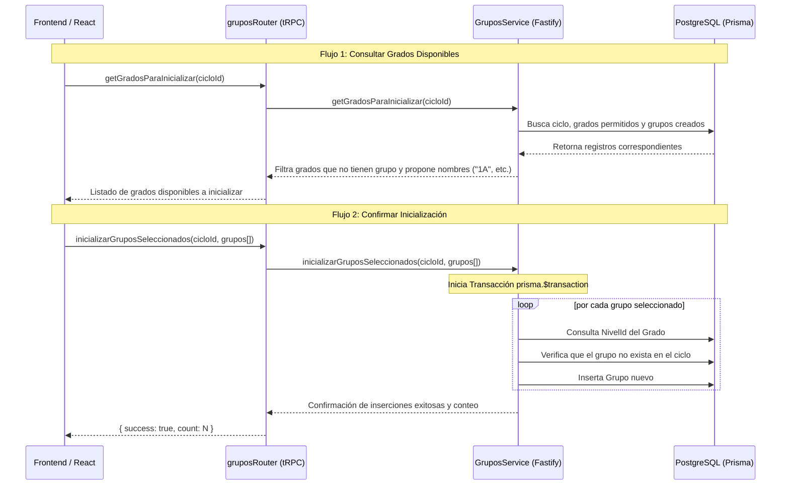

# Documentación Técnica: Inicialización Selectiva y Personalizada de Grupos

Este documento detalla la ingeniería inversa del diseño e implementación del nuevo flujo de **inicialización selectiva y parametrizada de grupos** en el backend del SGA.

---

## 1. Arquitectura y Flujo del Backend

El backend proporciona dos endpoints tRPC para consultar y ejecutar la inicialización de grupos para un ciclo escolar determinado, basándose en la configuración de grados permitidos (`gradosPermitidos` en `CicloEscolar`).

---

## 2. Contratos de Validación (Zod Schemas)

Ubicación: [grupos.schema.ts](file:///c:/Users/josem/Documents/San_Diego/sga/packages/back-end/src/modules/grupos/grupos.schema.ts)

*   **`getGradosParaInicializarSchema`:**
    *   Valida la consulta de grados enviando el `cicloId` (entero positivo obligatorio).
*   **`inicializarGruposSeleccionadosSchema`:**
    *   Valida la mutación de guardado. Requiere:
        *   `cicloId`: Entero positivo.
        *   `grupos`: Array de objetos que contienen:
            *   `gradoId` (int, > 0)
            *   `nombre` (string, longitud de 1 a 10)
            *   `cupoMaximo` (int, > 0, por defecto 30)

---

## 3. Lógica de Negocio y Control de Calidad

Ubicación: [grupos.service.ts](file:///c:/Users/josem/Documents/San_Diego/sga/packages/back-end/src/modules/grupos/grupos.service.ts)

### A. Consulta Inteligente de Grados Disponibles (`getGradosParaInicializar`)
1.  **Validación de Existencia:** Comprueba que el `cicloId` corresponda a un ciclo activo no eliminado.
2.  **Extracción de Grados Habilitados:** Obtiene el mapeo JSON `gradosPermitidos` del ciclo. Si no tiene configurados grados, retorna un listado vacío `[]`.
3.  **Aislamiento de Existentes:** Consulta todos los grupos activos físicamente creados en el ciclo. Genera un conjunto (`Set`) con los `gradoId` ya inicializados.
4.  **Filtro y Propuesta:** Retorna únicamente los grados permitidos que **no tienen** grupos en el ciclo. Propone un nombre estándar combinando el número de grado con el sufijo "A" (ejemplo: `numero: 2` -> `nombrePropuesto: "2A"`).

### B. Transacción de Creación Selectiva (`inicializarGruposSeleccionados`)
1.  **Transaccionalidad Atómica:** Toda la inicialización se realiza dentro de un bloque `prisma.$transaction`. Si ocurre algún fallo con algún grupo, toda la operación se revierte.
2.  **Prevención de Conflictos:** Por cada grupo a insertar:
    *   Consulta el `nivelId` dinámicamente desde el grado para garantizar la consistencia referencial de la jerarquía educativa.
    *   Verifica si ya existe un grupo activo con el mismo nombre en el mismo grado/ciclo escolar. Si existe, lo ignora (`continue`) para evitar interrupciones o duplicaciones duplicados accidentales.
    *   Crea el registro de grupo asignándole la capacidad (`cupoMaximo`) provista o el valor por defecto de 30.

---

## 4. Pruebas Unitarias y Cobertura

Ubicación: [grupos.service.test.ts](file:///c:/Users/josem/Documents/San_Diego/sga/packages/back-end/src/modules/grupos/grupos.service.test.ts)

Se implementaron pruebas que validan los comportamientos claves del servicio:
1.  **Prueba de Filtro de Grados:** Simula un escenario donde el ciclo permite los grados 1 y 2, pero el grado 1 ya posee un grupo en el ciclo. Asegura que el servicio solo devuelva el grado 2 con su propuesta de nombre `"2A"`.
2.  **Prueba de Ciclo Inexistente:** Valida que el servicio lance un error controlado si se consulta un ciclo inexistente.
3.  **Prueba de Inserción Transaccional:** Verifica que la mutación cree los grupos correctamente, resuelva el `nivelId` adecuado para cada uno de ellos y ejecute la llamada de creación en base de datos con los parámetros seleccionados.
