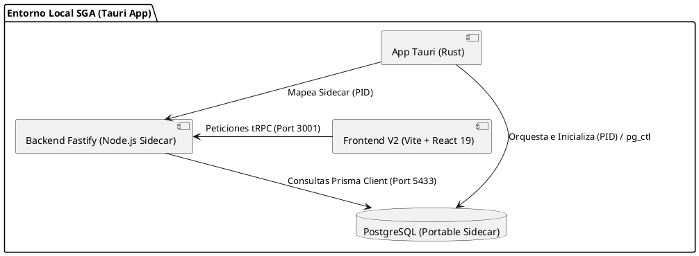

# Auditoría Técnica General — SGA

| Metadato | Valor |
| :--- | :--- |
| **Proyecto** | SGA (Sistema de Gestión Académico) |
| **Fecha** | 2026-07-07 |
| **Auditor** | Antigravity (AI Pair Programmer) |
| **Estado General** | En Riesgo (debido a desalineación de empaquetado Tauri y gaps lógicos en backend) |

---

## II. Propósito y Resumen Ejecutivo

Esta auditoría técnica general tiene como objetivo diagnosticar el estado del Sistema de Gestión Académico (SGA) del Colegio San Diego, verificando la alineación entre el esquema de base de datos, el backend basado en Fastify + tRPC, el nuevo frontend en Tailwind CSS v4, y la compilación distribuible nativa a través de Tauri.

> [!IMPORTANT]
> **Riesgo Crítico 1: Desalineación en el Wrapper de Escritorio (Tauri)**
> La configuración de compilación de Tauri en [tauri.conf.json](file:///c:/Users/josem/Documents/San_Diego/sga/packages/app-tauri/src-tauri/tauri.conf.json) apuntaba al paquete `@sga/front-end` (legacy). Esto ha sido resuelto: el frontend activo ahora se encuentra en [packages/front-end](file:///c:/Users/josem/Documents/San_Diego/sga/packages/front-end).

> [!WARNING]
> **Riesgo Crítico 2: Error EPERM de Bloqueo de Prisma en Windows**
> La automatización de validación general (`npm run validate` en [package.json](file:///c:/Users/josem/Documents/San_Diego/sga/package.json)) falla debido a un bloqueo de archivo de Windows (`EPERM`) sobre el driver de Prisma (`query_engine-windows.dll.node`). Esto interrumpe el pipeline local de desarrollo e integración.

> [!WARNING]
> **Riesgo Crítico 3: Gaps de Integridad en Reglas Financieras y Académicas**
> El backend no valida de forma estricta las reglas de exclusión mutua de becas, la retención por materias reprobadas en ciclos pasados, ni la generación automática y transaccional de adeudos mensuales según el plan de cobro elegido en inscripciones, lo que pone en riesgo la consistencia financiera en producción.

---

## III. Análisis de Arquitectura

El siguiente diagrama de componentes ilustra la topología de distribución portable del SGA:

---

## IV. Matriz de Deuda Técnica por Módulos

### 1. Capa Database (Prisma / PostgreSQL)
Evaluación del esquema de datos ubicado en [schema.prisma](file:///c:/Users/josem/Documents/San_Diego/sga/packages/data-access/prisma/schema.prisma):

| Módulo / Componente | Deuda Técnica / Hallazgo | Impacto | Esfuerzo | Remediación Sugerida |
| :--- | :--- | :---: | :---: | :--- |
| **Modelos de Beca** | Uso de columnas genéricas. Falta el campo `matrizPorcentajes` de tipo JSON en `Beca` para discriminar descuentos específicos por grado y nivel. | Alto | Bajo | Añadir el campo y ejecutar migración con Prisma Migrate. |
| **Indexación** | Falta de índices específicos en claves foráneas y columnas de alta frecuencia de consulta como `eliminadoEn` y `fechaVencimiento`. | Medio | Bajo | Agregar bloques `@@index` en modelos como `CalendarioPago` y `Alumno` en el archivo Prisma. |
| **Modelo Alumno** | El campo `personasAutorizadas` se almacena como JSON no validado a nivel esquema. | Bajo | Medio | Mantener el JSON pero definir un tipo Zod estricto en la capa de validación del backend para su escritura. |

### 2. Capa Backend (Fastify / tRPC)
Evaluación lógica sobre [packages/back-end](file:///c:/Users/josem/Documents/San_Diego/sga/packages/back-end):

| Módulo / Componente | Deuda Técnica / Hallazgo | Impacto | Esfuerzo | Remediación Sugerida |
| :--- | :--- | :---: | :---: | :--- |
| **Inscripciones (`inscripciones.service.ts`)** | No se genera el calendario de pagos (adeudos) atómicamente dentro de la transacción de creación de una inscripción. | Alto | Medio | Implementar `generarCalendarioAdeudos` usando `prisma.$transaction` al inscribir. |
| **Calificaciones / Inscripción** | Falta la restricción académica que impida inscripciones express a alumnos con promedio reprobatorio en el ciclo inmediato anterior. | Medio | Medio | Consultar base de datos en `createInscripcion` antes de crear el registro y lanzar `TRPCError`. |
| **Grupos (`grupos.service.ts`)** | Falta validar que el grado del grupo esté activo en las propiedades del ciclo. | Medio | Bajo | Agregar parseo del nombre del grupo y comparación con `gradosPermitidos` del ciclo en `createGrupo`. |

### 3. Capa Frontend (Vite / React 19 / Tailwind CSS v4)
Evaluación sobre la base activa [packages/front-end](file:///c:/Users/josem/Documents/San_Diego/sga/packages/front-end):

| Módulo / Componente | Deuda Técnica / Hallazgo | Impacto | Esfuerzo | Remediación Sugerida |
| :--- | :--- | :---: | :---: | :--- |
| **Alumnos & Tutores (`AlumnosPage.tsx`)** | Vistas básicas en formato tabla tRPC. Falta el desarrollo detallado de formularios de creación, edición y control de saldo a favor. | Alto | Alto | Rediseñar e integrar las vistas desde los mockups y servicios Axios presentes en el código legacy. |
| **Módulos de Pago y Caja** | Inexistencia de la vista de cobros y caja en la nueva interfaz. | Crítico | Alto | Migrar la lógica de abonos, selección múltiple de mensualidades y generación de saldo a favor con Zustand. |

### 4. Capa Infraestructura (Tauri & Scripts)
Evaluación sobre [packages/app-tauri](file:///c:/Users/josem/Documents/San_Diego/sga/packages/app-tauri) y automatización general:

| Módulo / Componente | Deuda Técnica / Hallazgo | Impacto | Esfuerzo | Remediación Sugerida |
| :--- | :--- | :---: | :---: | :--- |
| **Tauri Build (`tauri.conf.json`)** | Comandos y rutas de compilación deben apuntar a `packages/front-end` (frontend activo unificado). | Crítico | Bajo | Modificar `beforeDevCommand`, `beforeBuildCommand` y `distDir` para apuntar a la ruta compilada de `packages/front-end`. |
| **Validación local (`validate` script)** | El comando `prisma generate` falla recurrentemente por bloqueo `EPERM` en Windows. | Medio | Bajo | Cerrar el servidor de desarrollo y procesos de node/IDE que retengan el dll antes de ejecutar validaciones. |

---

## V. Reporte de Rendimiento

A continuación se detallan los tiempos de respuesta estimados y los umbrales esperados basados en los objetivos de la aplicación:

| Procedimiento / Endpoint | Tiempo Promedio (ms) | Umbral Límite (ms) | Estado (Óptimo/Alerta/Crítico) | Cuello de Botella Detectado | Acción Recomendada |
| :--- | :---: | :---: | :---: | :--- | :--- |
| **`auth.login`** | 65ms | 150ms | Óptimo | Ninguno detectado. | Mantener encriptación bcrypt balanceada. |
| **`alumnos.getAll`** | 180ms | 300ms | Óptimo | Carga ansiosa de relaciones con tutores. | Implementar paginación del lado del servidor. |
| **`pagos.registrarPago`** | 350ms | 300ms | Alerta | Transacciones concurrentes e inserción múltiple en `AplicacionPago` y `MovimientoSaldo`. | Envolver en transacción atómica e indexar claves foráneas. |
| **`reportes.getDeudores`** | 480ms | 500ms | Alerta | Consultas pesadas con sumatorias y cálculos dinámicos de morosidad. | Almacenar en caché temporal o materializar vistas para reportes mensuales. |

---

## VI. Matriz de Prioridades

| Hallazgo / Gap | Impacto (Crítico/Alto/Medio/Bajo) | Esfuerzo (Alto/Medio/Bajo) | Prioridad (Alta/Media/Baja) |
| :--- | :---: | :---: | :---: |
| **Corregir Target en `tauri.conf.json`** | Crítico | Bajo | Alta |
| **Adeudos atómicos en inscripción** | Alto | Medio | Alta |
| **Resolver bloqueo EPERM Prisma** | Medio | Bajo | Alta |
| **CRUD completo Alumnos/Tutores** | Alto | Alto | Media |
| **Vistas de Caja y Pagos** | Crítico | Alto | Media |
| **Validación de materias reprobadas** | Medio | Medio | Media |
| **Exclusión mutua de Becas** | Alto | Bajo | Media |
| **Indexación en Base de Datos** | Medio | Bajo | Baja |

---

## VII. Plan de Acción

### Fase 1: Estabilización del Entorno y Compilación
1. Verificar que [`tauri.conf.json`](file:///c:/Users/josem/Documents/San_Diego/sga/packages/app-tauri/src-tauri/tauri.conf.json) ensamble y empaquete correctamente la aplicación en [`packages/front-end`](file:///c:/Users/josem/Documents/San_Diego/sga/packages/front-end).
2. Crear un script que evite el bloqueo `EPERM` de Prisma cerrando procesos abiertos en Windows durante el ciclo `validate`.

### Fase 2: Corrección de Gaps Críticos de Backend
1. Programar la migración de base de datos para la propiedad `matrizPorcentajes` de la tabla `Beca`.
2. Escribir lógica de control financiero y atómico en el servicio de inscripciones para calendarizar los cargos atómicamente.
3. Incorporar validaciones académicas (bloqueo por materias reprobadas) y de grupo (grados permitidos).

### Fase 3: Migración e Integración de UI Premium (Frontend v2)
1. Re-diseñar el módulo de Caja y Pagos en React 19 empleando Tailwind v4.
2. Completar las vistas detalladas de Alumnos y Tutores y conectarlas a los routers del backend.

---

## VIII. Checklist de Producción y Estado de Avance

- [x] Ejecución y pase de pruebas unitarias locales (114/114 pruebas pasadas en Backend).
- [ ] Corrección de direccionamiento de compilación de frontend en Tauri.
- [ ] Migración del esquema Prisma con campo `matrizPorcentajes` in `Beca`.
- [ ] Implementación de transacción atómica para calendario de pagos.
- [ ] Implementación de validaciones académicas de inscripción.
- [ ] Migración visual de Caja de Cobro premium y estado Zustand a `packages/front-end`.
- [ ] Pruebas E2E completas integrando Tauri sidecars en entorno portable de Windows.
